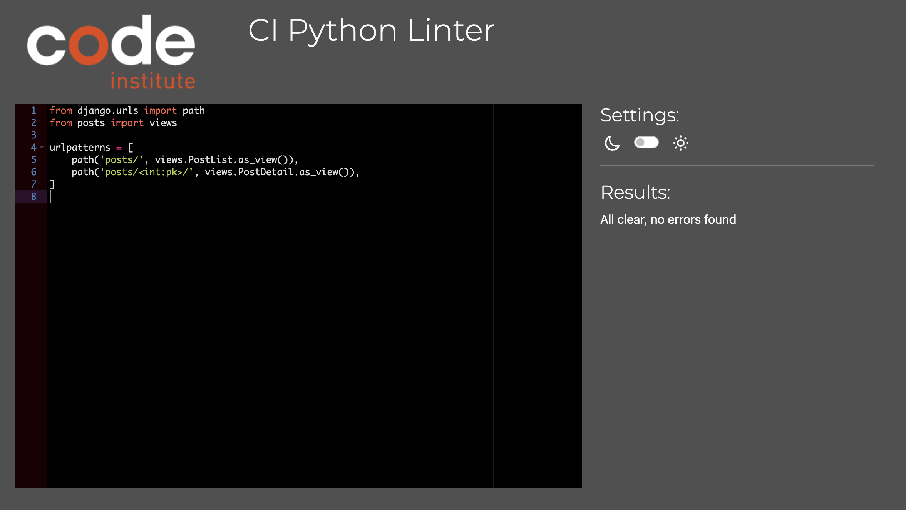

# **_Naifat - Django REST Framework API_**

The repository you are viewing is for the back-end REST API and my front-end React project will be detailed underneath, [Naifat](https://drf-api-app-65d9b6a619df.herokuapp.com/).

You can view the live site here - <a href="https://drf-api-app-65d9b6a619df.herokuapp.com/" target="_blank" rel="noopener">Naifat</a>

# Contents

- [**Objective**](#objective)
- [**Database**](#database)
- [**Models**](#models)
- [**Testing**](#testing)
  - [**Manual Testing**](#manual-testing)
  - [**PEP8 Validation**](#pep8-validation)
  - [**Bugs Fixed**](#bugs-fixed)
  - [**Bugs Unresolved**](#bugs-unresolved)
- [**Technologies Used**](#technologies-used)
- [**Deployment To Heroku**](#deployment-to-heroku)
- [**Cloning This Project**](#cloning-and-setting-up-this-project)
- [**Credits**](#credits)
  - [**Content**](#content)
  - [**Media**](#media)

# Objective

The main aim of the Djange Rest Framework API is to provide a reliable and secure way for the data used in my [naifat](https://naifat-75fb49666f3a.herokuapp.com/) front-end project to be provided. The aim of this API is to be simple and efficient so the data required for the application can be represented well.

[Back to top](#contents)

# Database

For this project, I implemented a PostgreSQL database hosted by [ElephantSQL](https://www.elephantsql.com/) for the production database.


[Back to top](#contents)

# Models

### Followers

The followers model is designed to contain all relevent information regarding what followers users on the Naifat platform have.


### Likes
The likes model is designed to contain all relevent information regarding what likes posts on the Naifat platform have.


### Posts
The posts model is designed to contain all relevent information regarding what posts users on the Naifat platform are creating.


### Profiles 
The profiles model is designed to contain all relevent information regarding what users are being created on the Naifat platform.


### Comments
The comments model is designed to contain all relevent information regarding what comments users on the Naifat platform are leaving under posts.


[Back to top](#contents)

# Testing

- ## Manual Testing


- ## PEP8 Validation

  I've tested all the files through the [CI PEP8 Linter](https://pep8ci.herokuapp.com/#) and although I found a few errors, I have rectified these and now all files are passing with "All clear, no errors found", as for the settings file for my drf_api application, the errors relating to the lines being too long only refer to long paths that must be on one line.

  ### drf_api

  
  
  
  
  

  ### comments

  
  
  
  

  ### followers
  
  
  
  

  ### likes 
  
  
  
  

  ### posts
  
  
  
  
  

  ### profiles
  
  
  
  

- ## Bugs Fixed

#### Through my development I encountered some easily fixed bugs, firstly my workspace was throwing an error due to my mistake of putting CLOUDINARYURL before my cloudinary link in my env.py file, I removed this and the eroor was gone.
 
 


#### This error occurred due to my settings.py file not included the up to date version of my gitpod url for the workspace- this was fixed by updating the url.
 


 #### In this error I forgot to add a capital P to my Procfile- this was easily fixed.
 

 - ## Bugs Unresolved

  - As far as I'm aware, there are not any unresolved bugs<br />

  # Technologies Used

## Languages

- [Python](https://www.python.org/) - A programming language that lets you work quickly
  and integrate systems more effectively

## Libraries and Frameworks

- [Django](https://pypi.org/project/Django/) - Django is a high-level Python web framework that encourages rapid development and clean, pragmatic design.
- [Django REST Framework](https://pypi.org/project/djangorestframework/) - A powerful and flexible toolkit for building Web APIs

# Technologies Used

## Languages

- [Python](https://www.python.org/) - A programming language that lets you work quickly
  and integrate systems more effectively

## Libraries and Frameworks

- [Django](https://pypi.org/project/Django/) - Django is a high-level Python web framework that encourages rapid development and clean, pragmatic design.
- [Django REST Framework](https://pypi.org/project/djangorestframework/) - A powerful and flexible toolkit for building Web APIs

## Packages


- [cloudinary](https://pypi.org/project/cloudinary/) - Easily integrate your application with Cloudinary
- [dj-database-url](https://pypi.org/project/dj-database-url/) - Allows you to utilize the 12factor inspired DATABASE_URL environment variable to configure your Django application.
- [dj-rest-auth](https://pypi.org/project/dj-rest-auth/) - API endpoints for handling authentication securely in Django Rest Framework
- [django-allauth](https://pypi.org/project/django-allauth/) - Integrated set of Django applications addressing authentication, registration, account management as well as 3rd party (social) account authentication
- [django-cloudinary-storage](https://pypi.org/project/django-cloudinary-storage/) - package that facilitates integration with Cloudinary by implementing Django Storage API
- [django-cors-headers](https://pypi.org/project/django-cors-headers/) - Adds Cross-Origin Resource Sharing (CORS) headers to responses.
- [django-extensions](https://pypi.org/project/django-extensions/) - Collection of global custom management extensions for the Django Framework.
- [django-filter](https://pypi.org/project/django-filter/) - Declaratively add dynamic QuerySet filtering from URL parameters.
- [django-rest-auth](https://pypi.org/project/django-rest-auth/) - Provides a set of REST API endpoints for Authentication and Registration
- [djangorestframework-simplejwt](https://pypi.org/project/djangorestframework-simplejwt/) - JSON Web Token authentication plugin for the Django REST Framework.
- [gunicorn](https://pypi.org/project/gunicorn/) - A Python WSGI HTTP Server for UNIX.
- [oauthlib](https://pypi.org/project/oauthlib/) - Implements the logic of OAuth1 or OAuth2 without assuming a specific HTTP request object or web framework.
- [pathspec](https://pypi.org/project/pathspec/) - Utility library for pattern matching of file paths
- [psycopg2](https://pypi.org/project/psycopg2/) - PostgreSQL database adapter for Python
- [PyJWT](https://pypi.org/project/PyJWT/) - Library for encoding and decoding JSON Web Tokens (JWT)
- [requests](https://pypi.org/project/requests/) - Allows you to send HTTP/1.1 requests
- [requests-oauthlib](https://pypi.org/project/requests-oauthlib/) - OAuthlib authentication support for Requests
- [sqlparse](https://pypi.org/project/sqlparse/) - A non-validating SQL parser for Python.

## Other Tools

- [Gitpod](https://www.gitpod.io/) - Used to create and edit the website.
- [GitHub](https://github.com/) - Used to host and deploy the website as well as manage the project.
- [GitBash](<https://en.wikipedia.org/wiki/Bash_(Unix_shell)>) - Terminal used to push changes to the GitHub repository.
- [Heroku](https://dashboard.heroku.com) - Used to deploy the website
- [ElephantSQL](https://www.elephantsql.com/) - Provides a browser tool for SQL queries where you can create, read, update and delete data directly from your web browser.
- [Cloudinary](https://cloudinary.com/) - Used to host all static files .
- [TablePlus](https://tableplus.com/) - Used to view databases in a clean, simple way.
- [CI PEP8 Linter](https://pep8ci.herokuapp.com/#) - Used to check the Python code for any linting issues

[Back to top](#contents)

# Deployment To Heroku

The project was deployed to [Heroku](https://www.heroku.com). The deployment process is as follows:

Firstly we need to create a new repository in [GitHub](https://github.com/) where our project files will be located

- Navigate to [GitHub](https://github.com/)
- Create a new repository.

Now it's time to install Django and some additional packages

- Install Django by typing **pip install 'django<4'**
- Create our new project by typing **django-admin startproject drf_api_deployment_process .**
- Install cloudinary storage by typing **pip install django-cloudinary-storage**
- Install Pillow by typing **pip install Pillow**

Now we need to add our newly installed apps to our **settings.py** file

Next, create a new **env.py** file and paste in the following code - remembering to change the "YOUR CLOUDINARY URL HERE" part to your API key

```Python
import os

os.environ["CLOUDINARY_URL"] = "YOUR CLOUDINARY_URL_HERE"

```

Back in our **settings.py** file we need to import our **env.py** file if it exists

```Python
import os

if os.path.exists("env.py"):
    import env
```

Now we need to reference our new Cloudinary URL in **settings.py**

```Python
CLOUDINARY_STORAGE = {"CLOUDINARY_URL": os.environ.get("CLOUDINARY_URL")}
```

Now we need to define our MEDIA_URL and DEFAULT_FILE_STORAGE in **settings.py**

```Python
MEDIA_URL = "/media/"

DEFAULT_FILE_STORAGE = "cloudinary_storage.storage.MediaCloudinaryStorage"
```

Now it's time to start creating our applications. For my project I created 6 seperate applications

- **drf_api**
- **comments**
- **followers**
- **likes**
- **posts**
- **profiles**

Don't forget to add these applications to the INSTALLED_APPS variable in **settings.py**

Next: 

Install JSON Web Token Authentication

- In the terminal type **pip install dj-rest-auth**

Add both rest framework’s auth token and django rest auth to INSTALLED APPS -

```Python
INSTALLED_APPS = [
    "rest_framework.authtoken",
    "dj_rest_auth",
]
```

Now add the urls to the urlpatterns list **path('dj-rest-auth/', include('dj_rest_auth.urls'))**

```Python
urlpatterns = [
    path("dj-rest-auth/", include("dj_rest_auth.urls")),
]
```

Now migrate the database by typing **python manage.py migrate**

Next install Django All Auth with the following command - **pip install 'dj-rest-auth[with_social]'** and add the new application to the INSTALLED_APPS vairable in **settings.py**

```Python
INSTALLED_APPS = [
    "django.contrib.sites",
    "allauth",
    "allauth.account",
    "allauth.socialaccount",
    "dj_rest_auth.registration",
]
```

Now add a SITE_ID variable in **settings.py**

```Python
SITE_ID = 1
```

Add the registration urls to the urlpatterns list

```Python
urlpatterns = [
    path('dj-rest-auth/registration/', include('dj_rest_auth.registration.urls')),
]
```

Now it's time to Add JWT tokens functionality, in the terminal type in the following command **pip install djangorestframework-simplejwt**

In **env.py** add the following variable

```Python
os.environ['DEV'] = '1'
```

In **settings.py** set the DEBUG value equal to the DEV variable you just set in **env.py**

```Python
DEBUG = 'DEV' in os.environ
```

Next, still in **settings.py** add the following code differentiate between development and production modes and also set the pagination and date time format

```Python
REST_PAGINATION = "rest_framework.pagination.PageNumberPagination"

REST_FRAMEWORK = {
    "DEFAULT_AUTHENTICATION_CLASSES": [
        (
            "rest_framework.authentication.SessionAuthentication"
            if "DEV" in os.environ
            else "dj_rest_auth.jwt_auth.JWTCookieAuthentication"
        )
    ],
    "DEFAULT_PAGINATION_CLASS": REST_PAGINATION,
    "PAGE_SIZE": 100,
    "DATETIME_FORMAT": "%d %b %Y",
}
```

And now add the following code to **settings.py** to enable token authentication, cookie declaration and to also ensure that the tokens are sent over HTTPS only

```Python
REST_USE_JWT = True
JWT_AUTH_SECURE = True
JWT_AUTH_COOKIE = "my-app-auth"
JWT_AUTH_REFRESH_COOKIE = "my-refresh-token"
JWT_AUTH_SAMESITE = "None"
```

Now we can create a new root route which will act as a welcome screen to anyone who visits the root route of our API

- Create a new **views.py** file in your main project folder (drf_api_league_hub) and add the following code

```Python
from rest_framework.decorators import api_view
from rest_framework.response import Response


@api_view()
def root_route(request):
    """
    Function to return a welcome message
    upon loading the API
    """
    return Response({"message": "Welcome to the League Hub DRF API!"})
```

Add that new route to the urlpatterns list in the main **urls.py** file

```Python
from .views import root_route

    path("", root_route),
```

Create a new production database with [ElephantSQL](https://www.elephantsql.com/)

- Log into [ElephantSQL](https://www.elephantsql.com/)
- Click **Create New Instance**
- Give your plan a name
- Select \*_Tiny Turtle (Free)_ plan
- Click **Select Region** and pick a data center near you
- Click **Review**, double check the information you provided, once happy, click **Create Instance**

We need to get the new database URL from the [ElephantSQL](https://www.elephantsql.com/) dashboard.

Return to the dashboard, find your newly created plan and copy the URL

Back in our local project, in **eny.py** we can add our copied production database URL and store it in a new variable which can be referenced without exposing the value to unwanted eyes

```Python
os.environ.setdefault(
    "DATABASE_URL", "YOUR DB URL HERE",
)
```

In the terminal, type in **pip install dj_database_url**

After that has installed, we need to import it into our main **settings.py** file

```Python
import dj_database_url
```

Now we can seperate the development and production environment databases with the following code

```Python
if "DEV" in os.environ:
    DATABASES = {
        "default": {
            "ENGINE": "django.db.backends.sqlite3",
            "NAME": BASE_DIR / "db.sqlite3",
        }
    }
else:
    DATABASES = {"default": dj_database_url.parse(
        os.environ.get("DATABASE_URL"))}
    print("Connected to live database")
```

Next we need to install gunicorn. In the terminal, type in the following

- **pip install gunicorn**

Now created a Procfile at the root level in your project


Within that newly created Procfile, add the following code to let Heroku know how to run the project

```Python
release: python manage.py makemigrations && python manage.py migrate
web: gunicorn drf_api_league_hub.wsgi
```

Back in **settings.py**, we need to tell the project which hosts to allow

```Python
ALLOWED_HOSTS = [
    os.environ.get("ALLOWED_HOST"),
    "127.0.0.1",
]
```

Now it's time to install **CORS**

In the terminal, **pip install django-cors-headers** and then add to the INSTALLED_APPS

```Python
INSTALLED_APPS = [
    'corsheaders',
]
```

Add it to the MIDDLEWARE list at the top of the list

```Python
MIDDLEWARE = [
    "corsheaders.middleware.CorsMiddleware",
]
```

Now we need to set the ALLOWED_ORIGINS for the network requests made to the server. In **settings.py** file, add the below

```Python
if "CLIENT_ORIGIN" in os.environ:
    CORS_ALLOWED_ORIGINS = [
        os.environ.get("CLIENT_ORIGIN"),
    ]
if "CLIENT_ORIGIN_DEV" in os.environ:
    CORS_ALLOWED_ORIGINS.append(os.environ.get("CLIENT_ORIGIN_DEV"))

CORS_ALLOW_CREDENTIALS = True

JWT_AUTH_SAMESITE = 'None'
```

Now we need to replace the SECRET_KEY variable in **settings.py** to reference the secret key that we will create in **env.py**

In **env.py** create a new variable called SECRET_KEY and give it a value

```Python
os.environ.setdefault("SECRET_KEY", "YOUR SECRET KEY HERE")
```

Now back in **settings.py**, change the SECRET_KEY value to point to the SECRET_KEY you just created in **env.py**

```Python
SECRET_KEY = os.getenv("SECRET_KEY")
```

Update the requirements file by typing in the command in the terminal **pip freeze > requirements.txt**

- git add
- git commit -m "{message here}
- git push

Now it's time to deploy our new project live for everyone to see on [Heroku](https://www.heroku.com)

- Navigate to [Heroku](https://www.heroku.com)
- Click **New app**
- Fill in the relevant information
- Click **Create app** once you are happy


Once you've created your new [Heroku](https://www.heroku.com) application, we need to add some config variables. Click the **settings** tab and then click **Reveal Config Vars**

Make sure to add the following config variables

- ALLOWED_HOST - This is the URL of your deployed project (without the https)
- CLIENT_ORIGIN - This is the URL of your deployed front-end project
- CLIENT_ORIGIN_DEV - This is the URL when developing locally
- CLOUDINARY_URL - This is your Cloudinary API key
- DATABASE_URL - This is your production database URL
- DISABLE_COLLECTSTATIC - This will be removed before submission
- SECRET_KEY - This is the secret key you have created


Now we need to link our [Heroku](https://www.heroku.com) application with our [GitHub](https://github.com/) project

- Click the **Deploy** tab
- Choose **GitHub**
- Search for your repository
- Once found, click **Connect**

Finally, we can deploy our connected projected for everyone to see.

You can either choose **Enable Automatic Deploys** or **Deploy Branch**. I chose to deploy my application automatically.

- Click **Deploy Branch** and wait for it to build

[Back to top](#contents)

### Content

This project was created and inspired by following the [Code Institute](https://codeinstitute.net/) DRF-API walkthrough.

I spent some time looking through the official [Django REST Framework Documentation](https://www.django-rest-framework.org/api-guide/permissions/) to also aid my development.

[Back to top](#contents)

# **_Naifat_**

This part of the repository you are viewing is for the front-end of the app [Naifat](https://drf-api-app-65d9b6a619df.herokuapp.com/).

You can view the live site here - <a href="https://drf-api-app-65d9b6a619df.herokuapp.com/" target="_blank" rel="noopener">Naifat</a>.


# Contents

- [**Objective**](#objective)
- [**User Experience UX**](#user-experience-ux)
  - [Project Goals](#project-goals)
  - [User Stories](#user-stories)
  - [Design Prototype](#design-prototype)
  - [Reasons For Design](#reasons-for-design)
  - [Fonts](#fonts)
  - [Colour Scheme](#colour-scheme)
  - [Project Management](#project-management)
- [**Permissions**](#permissions)
  - [Logged Out User](#logged-out-user)
  - [Logged In User](#logged-in-user)
- [**Existing Features**](#existing-features)
  - [Home Page](#home-page)
  - [Sign In Page](#sign-in-page)
  - [Sign Up Page](#sign-up-page)
  - [Profile Page](#profile-page)
  - [Signed In Home Page](#signed-in-home-page)
  - [Create Post](#create-post)
  - [Edit Post](#edit-post)
  - [Comments](#comments)
- [**Future Features**](#future-features)
  - [Events](#events)
  - [News](#news)
  - [Streams](#streams)
- [**Technologies Used**](#technologies-used)
- [**Testing**](#testing)
- [**Deployment To Heroku**](#deployment-to-heroku)
- [**Credits**](#credits)
  - [**Content**](#content)
  - [**Media**](#media)
- [**Acknowledgments**](#acknowledgements)

# Objective

For my fifth and final project, I intend to create an online blog still social platform where many beauty enthusiasts can come together to share their knowledge and passion on all things, bath, beauty and glamour. I aim to demonstrate a good understanding in creating a website using React JS for the front end and Django REST framework for the backend whilst adhering to agile methodologies.

[Back to top](#contents)

## Project Goals

1 - Build a project to help users gain knowledge on different beauty products <br>
2 - Ensure the project is fully responsive to cater for all user device screen sizes <br>
3 - Design an intuitive layout that promotes a positive user experience <br>
4 - Implement a theme that compliments the project <br>
5 - Allow users to quickly search for a post <br>
6 - Allow users to filter posts <br>
7 - Give the users the ability to edit and remove a post <br>
8 - Give the users the ability to view who the 'popular reviewers' are <br>
9 - Give the users the ability to create/edit and delete a comment on a post <br>
10 - Require users to have an account to access additional features <br>

## User Stories

My user stories are in the project of my respository where I worked on the front end of my app before combining my workspaces.

You can view this project from *<a href="https://github.com/NaifatSelina/naifat" target="_blank" rel="noopener">this</a>* repository.


[Back to top](#contents)

## Design Prototype

During the design wireframes process I decided to use [Figma](https://www.figma.com/) in my project. Figma quickly and efficiently allows me to create outlines for how I would like my project to look. I was able to create a rough colour scheme that I knew I wanted to use, something clean, fresh and timeless. The simplistic layout and structure of each of the design wireframes is something which I wanted to keep in the final version of the app as I knew I needed the beauty app to be easy to navigate to heighten accessability. My audience for this app was people of all technical capabilities, as everyone should be able to come together to learn and share their knowledge and learn about the beauty services and products they are indulging in- it was a necessity that the structure remained simple.

<br>
<br>
<br>


<br />

[Back to top](#contents)

## Components

This project was created using React which allows for the re-use of components throughout the application. A react component is able to perform a multitude of operations such as render elements on a page, display data, handle events/user interactions etc.<br />


<br />


## Reasons for Design 
### Fonts 
- For consistency the main chosen font I decided to use was Playfair Display, with sans-serif as the fall-back font to be used if Playfair Display cannot be loaded by the browser. I gravitated towards this font as it is a font that maintains a professional and sleek look that is easily readable to heighten accessibility and ease of use of the platform. 
- Across the webpage, to create a dynamic feel, I used a range of font-weights. 

### Colour Scheme 
- The colour scheme chosen for application is a balance of fresh, simple and clean. The main background colours of stone and sage provide a fresh feel, with the black and baby pink accent colours providing pretty and a welcoming feel. 
- More so, the use of black text effectively complimented the lighter colour choices as it created a good contrast. Combined, the colours perfectly corresponded with the desired overall feel of the platform and enhanced user experience with the black and stone colours standing out completely from the white and sage background colours used throughout the platform.

  
  
  
  
  

  <br />

 [Back to top](#contents)

  ## Project Management

- ### GitHub Project Board

  To manage this project I utilised the project management features available of GitHub. I created a Kanban board so I could organise and manage my issues/tasks for the project and monitor my progress as I built the application eventually moving each task along to the 'done' section of the kanban board. This also meant I was able to use Agile Methodology to help plan and execute the project.<br />

  You can view this project board from *<a href="https://github.com/NaifatSelina/naifat" target="_blank" rel="noopener">this</a>* repository as it was create prior to combining my front-end and back-end workspaces.

  

  - ### GitHub Milestones

  Furthermore, when adding my user stories, I decided to take advantage of the milestone feature so I could manage the progress of my user stories required for release as I completed the project. I treated every 3 user stories as a sprint and would spend an allocated amount of time on each. This also acted as motivation as I was able to see the bar progress as I did.

  You can view this milestone from *<a href="https://github.com/NaifatSelina/naifat" target="_blank" rel="noopener">this</a>* repository as it was create prior to combining my front-end and back-end workspaces.

  

  ## Permissions

  [Back to top](#contents)
### Logged Out User

A logged out user will have access to the following

- Home Page
- Profile Pages
- Sign In Page
- Sign Out Page
- Comments Visability
- Popular Reviewers Visibility
- Posts
- Likes Visibility

### Logged In User

A logged in user will have access to the following:

- Home Page
- Profile Pages
- Sign In Page
- Sign Out Page
- Comments Visability
- Popular Reviewers Visibility
- Posts
- Likes Visibility
- **Ability to sign out**
- **Create a Post**
- **Ability to like and unlike a Post**
- **Ability to remove their Post**
- **Ability to create a Comment**
- **Ability to edit their Own Comment**
- **Ability to delete their own comment**
- **Ability to view their profile page**
- **Ability to update their profile information**
- **Ability to edit their Post**
- **Ability to follow and unfollow other users**

[Back to top](#contents)

## Existing Features


- ### Home Page

When the user arrives onto the application they are greeted with the refreshing and simply structured homepage. It was important that the structure didn't drastically change as the user navigates through the app for lack of confusion, ease of use and general accessibility needs. The user can expect to see a nav bar at fixed to the top of the page with a logo and a nav bar on the left in which they can navigate to refresh the home page or navigate the the sign in or sign up page. Underneath they can search for a post or just begin to scroll down their feed and see the most recent posts if they are just aiming to browse. On the left hand side of the screen users can see popular reviewers who are ranked by how many followers they have aquired. Users can select these users and see their specific posts, bios and follower counts if they want to browse the most popular reviewers on the platform or even if they aim to be up there themselves! The users can view full posts and likes and comments on posts however they are not able to create posts, like or comment themselves. 

On smaller devices the popular reviewers section will float to the top of the feed and the nav bar will collapse into hamburger menu fashion for responsivity.


- ### Sign In Page

Users that have already signed up can sign in through the simple form presented. As stated before, that aim of the platform is supposed to be easy and simple to use as everyone should be able to contribute and access beauty knowledge. I decided to add a simple, fresh and clean image to compliment the webpage and that compliments the colour scheme. Users that accidently navigate to this page can click the text link below the sign in for the urges users to sign up to quickly navigate the the sign up page.


- ### Sign Up Page

Users that wish to sign up can use this simple form to sign up, I also decided to add a simple, fresh and clean image to compliment the webpage and that compliments the colour scheme to the sign up page too.


- ### Profile Page

I kept the profile page simple too, users signed in and not signed in are able to see individuals profiles, this will include the profile owners name, chosen profile photo, number of posts, followers, following and their bio. Underneath this, users can expect to see posts made by the individual. The popular reviews section remains on the side of the page. Logged in users are able to edit their profile.


- ### Signed In Home Page

The differences seen here compared to the logged out user are the ability to like and comment on a post in addition to being able to follow and unfollow users. The ability to create a post will also appear in the nav bar.


- ### Create Post

Logged in users are able to create a post by navigating the the create post text in the nav bar, they'll be able to add a title, content and photo.


- ### Edit Post

Users will be able to edit their posts.


- ### Comments

Users will be able to comment and interact on posts. For instance, agreeing with reviews, stating if they've had alternative experiences or just simply giving further insight into the products or services being posted. Users can also like to show their support of simply unlike if they change their mind.


[Back to top](#contents)

- ## Future Features

 ### Events

 - I believe having events would be a great future feature to have, I would begin with virtual events with topics such as makeup, best deals this month or bathtime essentials, where individuals can come together and share their knowledge, network and share positivity. 

 ### News

 - Having a page where users can be kept up to date with all the recent news regarding beauty and eventually fashion too would be a create way to expand the application past just posts- almost like a 'trending' page for all things beauty.

 ### Streams

 - Having different streams acting as 'channels' which users can see all things such as posts, users, events and news pertaaining to a certain topic such as hair products would be fun and beneficial.

 [Back to top](#contents)

 # Technologies Used

## Languages

- [JavaScript](https://www.javascript.com/).
- [HTML5](https://en.wikipedia.org/wiki/HTML5).
- [CSS3](https://en.wikipedia.org/wiki/CSS).

## Libraries and Frameworks

- [React](https://reactjs.org/) - Advanced front-end JavaScript Library.
- [Bootstrap](https://getbootstrap.com/) - CSS Framework.
- [Google Fonts](https://fonts.google.com/).
- [Font Awesome](https://fontawesome.com/).

## NPM Packages / Dependencies

- [axios](https://www.npmjs.com/package/axios).
- [react-bootstrap](https://react-bootstrap.github.io/).
- [react-dom](https://reactjs.org/docs/react-dom.html).
- [react-infinite-scroll-component](https://www.npmjs.com/package/react-infinite-scroll-component).
- [react-router-dom](https://www.npmjs.com/package/react-router-dom).
- [react-scripts](https://www.npmjs.com/package/react-scripts).

## Other Tools

- [a11y](https://color.a11y.com/Contrast/) - Used to test the contrast and accessibility.
- [Favicon](https://favicon.io/) - Used to create the favicon.
- [GitPod](https://www.gitpod.io/) - Used to create the website.
- [GitHub](https://github.com/) - Used to host and deploy the website as well as manage the project.
- [Google Chrome DevTools](https://developer.chrome.com/docs/devtools/) - Used to test responsiveness and debug.
- [Responsive Design Checker](https://www.responsivedesignchecker.com/) - Used to test responsiveness.
- [Am I Responsive](https://ui.dev/amiresponsive) - Used to further check responsivity.
- [Figma](https://www.figma.com/) - Used to create design wireframes.
- [Heroku](https://dashboard.heroku.com) - Used  for deployment.
- [JSHint Validation](https://jshint.com/) - Used to validate JavaScript code.

[Back to top](#contents)

# Testing

- ## Code Validation

  

- ## Lighthouse Testing

I am generally okay with the lighthouse results for each page however in future updates I will aim to increase the lighthouse performance score on mobiles.


- ## Accessibility Testing

  - To ensure the webpage included suitable colour contrasts I used [a11y](https://color.a11y.com/Contrast/) to test if there was any conflicting contrast issues with the colours and found no errors.

  

  <br /><br />

- ## Responsiveness Testing

  I've conducted responsive testing for desktop, tablet and mobile devices to ensure responsivity.
  <br /><br />

  


  <br />

  - ## Manual Testing

  - Ensure the logo redirects the home page.
  - Ensure the navigation links work.
  - Ensure the navigation bar collapses into hamburger menu on smaller screen.
  - Ensure Users are able to sign in and sign up.
  - Ensure users can comment and like on posts.
  - Ensure comments and posts can be seen and added to.
  - Ensure comments and posts are displayed by latest first.
  - Ensure users can view their profile.
  - Ensure users can view others profiles.
  - Ensure follower, post, likes and following counts go up as they inclease.
  - Ensure all signed in users can follow and unfollow eachother.
  - Ensure users can see popular profiles.
  - Ensure users can edit their posts and profiles.
  - Ensure users can create a post with an image, title and content.
  - Ensure users can delete comments and posts.
  - Ensure users can unfollow eachother and unlike posts.
  - Ensure users can search for posts.

  - ## Browser Compatibility

  - All the above manual tests have been completed in the following desktop browsers
    - Google Chrome
    - Safari

  <br />

[Back to top](#contents)

  - ## Bugs Fixed 

  ### nav bar
  
  - I ran into an issue of the nav bar floating over the feed of the page, I fixed this with some simple css added to the nav bar to ensure the main content of the page always flows under it.

  ### lack of env.py

  - At a point in my development my application was having multiple errors as my env.py was not in the root directory, this was fixed by me simply moving the file.

  ### CORS issue

  - A very promonent issue I was getting for quite a while was a CORS error which was being thrown when I would try and run my application, I would see this via Chrome Dev Tools. This was prior to the combination of my workspaces, it was an issue in my API apps settings file, I fixed the CORS error by combining my workspaces.

  - ## Bugs Unresolved

  ### home page refresh

  - Due to a potential cache issue with my browser, after using the webpage for a while, when trying to navigate the nav bar, the sign in and sign up links refresh the user to the home page. This has been extensively on my radar and I have attempted to find many avenues to fix this such as contacting tutors, slack, youtube and a good few Google searches. I hope to fix this error in the future. I don't believe this happens outside of my particular browser on my device however.

  [Back to top](#contents)

  # Deployment To Heroku

The project was deployed to [Heroku](https://www.heroku.com). The deployment process is as follows:

Firstly we need to create a new repository in [GitHub](https://github.com/) where our project files will be located

- Navigate to [GitHub](https://github.com/) and create a new repository.

Once you've created your new empty repository we need to initialize this project as a [React](https://reactjs.org/) project.

- Open up a new terminal within the project
- Type in **npx create-react-app . --use-npm**

Once completed, you can test your new [React](https://reactjs.org/) application is working by typing **npm start** in the terminal.

Now we can push our new project to our [GitHub](https://github.com/) repository.

- **git add .**
- **git commit -m "Initial commit"**
- **git push**

Now it's time to deploy our new project live for everyone to see on [Heroku](https://www.heroku.com).

- Navigate to [Heroku](https://www.heroku.com)
- Click **New app**
- Fill in the relevant information
- Click **Create app** once you are happy

Now we need to link our [Heroku](https://www.heroku.com) application with our [GitHub](https://github.com/) project.

- Click the **Deploy** tab
- Choose **GitHub**
- Search for your repository
- Once found, click **Connect**

Finally, we can deploy our connected projected for everyone to see.

You can either choose **Enable Automatic Deploys** or **Deploy Branch**.

- Click **Deploy Branch** and wait for it to build.

Your new [React](https://reactjs.org/) application is now successfully deployed to [Heroku](https://www.heroku.com)

[Back to top](#contents)

- ## Combined Workspace Deployment

As I combined my workspace I had to do some extra steps to deploy the **combined workspace**.

**Firstly you want to set up WhiteNoise for static files.**

- Install Whitenoise and add this dependency to your requirements.txt file.
- Create a new folder called staticfiles in root directory.
- Ensure installed apps are in correct order in settings.py file [cloudinary_storage should be under staticfiles app].
- Add WhiteNoise to MIDDLEWARE list.
- Add DIRS key in templates list so Django and WhiteNoise to know where to look for Reacts index.html file.
- Add STATIC_ROOT and WHITENOISE_ROOT to static files section of settings.py file.

**Next, we will need to configure the route to allow the React front-end to be viewed.**

- Go to urls.py: 
- Remove root_route view from the.views imports.
- Import TemplateView from Django views.
- Remove root_route code from url_patterns and add code pointing it to index.html.
- Add 404 handler to bottom of urls.py file.
- Add api/ to all but top two url paths.
- In axiosDefault.js comment back the axios.defaults.baseURL and set it to "/api".

**Following that we want to combine both Django and React static files and compile them.**

- Collect the admin and DRF staticfiles to the empty staticfiles directory you created earlier by running python3 manage.py collectstatic.
- Cd into the frontend directory [ cd frontend ].
- Run the command to compile and move the React files [ npm run build && mv build ../].staticfiles/.
- In the root directory of your project, create a new file named runtime.txt , inside the runtime.txt, add the following line: python-3.9.16.

**Once this is done we have to test that the builds for both parts of the project are running together.**

- Ensure all running servers are terminated. In any running terminals press Ctrl+C.
- In your env.py file, ensure that both the DEBUG and DEV environment variables are commented out.
- Run the Django server, in the terminal [python3 manage.py runserver].

**Now for the final steps to deploy to Heroku.**

-Log into Heroku account and access the dashboard for your DRF application.
-Go to Settings and open Config Vars.
-Ensure your application has an ALLOWED_HOST key, set to the URL of your combined project, remove the https:// at the beginning and remove the trailing slash at the end.
-Ensure your application has a CLIENT_ORGIN key and set it to the URL of your combined project. This time keep the https:// at the beginning but remove the trailing slash at the end.

**Your combined workspace will now be deployed.**

[Back to top](#contents)

# Credits

### Content

This project was inspired by the [Code Institute](https://codeinstitute.net/) walk-through **Moments** project and has been modified.

The files which have been created and used for the League Hub project that have been copied from the **Moments** walkthrough project were the following

### Media

The images seen on the webpage are all from [Pexels](https://www.pexels.com/), a website of the best free stock photos, royalty free images & videos shared by creators.

All icons used were provided by [Font Awesome](https://fontawesome.com/).

My logo was created using [Wi Logo Maker](https://www.wix.com/createlogo6/logo-maker?utm_source=google&utm_medium=cpc&utm_campaign=19596718059^152297742944&experiment_id=logo%20maker^e^645976108706^&gclid=Cj0KCQjwmICoBhDxARIsABXkXlJVFkbBFwBpCJwwD2KtNHADFiiIOqt2BiXSN4m90U7vwQw6kiwZ1NAaAlZyEALw_wcB) and turned into a useable logo using [Favicon](https://favicon.io/).

[Back to top](#contents)


# Acknowledgments

I have thoroughly enjoyed developing this project eventhough it took me a while and I bumped into many mental and emotional blockages. I learnt so much about the entire development process in such a short amount of time. I hope to use this knowledge attained in the future and expand and build upon it.


# Naifat 2023.


